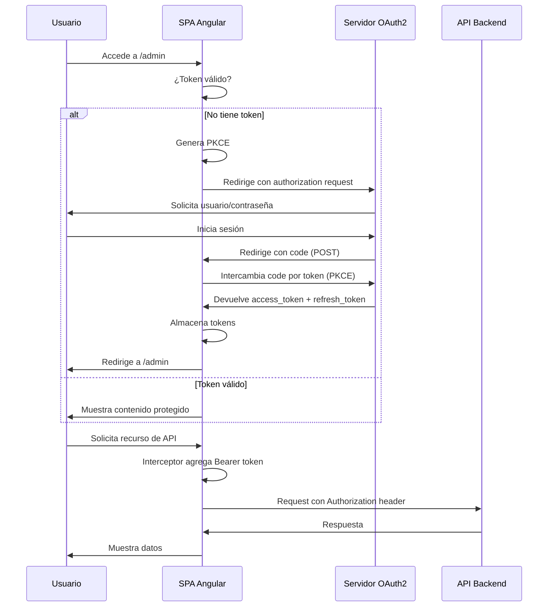

# Arquitectura OAuth2 Empresarial

## Descripción General

La implementación de OAuth2 ha sido refactorizada con una arquitectura empresarial escalable, mantenible y sigue principios SOLID.

## Estructura de Carpetas

```
src/app/auth/
├── services/
│   ├── auth.service.ts              # Servicio principal de autenticación
│   ├── auth-state.service.ts        # Gestión centralizada del estado
│   ├── token.service.ts             # Gestión de tokens (lectura/escritura)
│   ├── pkce.service.ts              # Generación y gestión de PKCE
│   └── oauth2-config.service.ts     # Configuración centralizada de OAuth2
├── guards/
│   └── auth.guard.ts                # Guard para proteger rutas
├── interceptors/
│   └── auth.interceptor.ts          # Interceptor HTTP para tokens
└── auth-callback.component.ts       # Componente para callback de OAuth2
```

## Servicios Principales

### 1. **TokenService** (`token.service.ts`)
Gestiona todos los aspetos relacionados con tokens.

**Responsabilidades:**
- Almacenar tokens en localStorage
- Recuperar tokens
- Validar expiración
- Limpiar tokens

**Métodos públicos:**
```typescript
setTokens(accessToken, refreshToken?, expiresIn?, tokenType?)
getAccessToken(): string | null
getRefreshToken(): string | null
isTokenExpired(): boolean
hasAccessToken(): boolean
clearTokens(): void
```

### 2. **PKCEService** (`pkce.service.ts`)
Genera y gestiona parámetros PKCE para seguridad.

**Responsabilidades:**
- Generar verifier aleatorio (128 caracteres)
- Generar challenge usando SHA-256
- Almacenar verifier temporalmente
- Limpiar verifier después del uso

**Métodos públicos:**
```typescript
generateChallenge(): PKCEChallenge
generateChallengeAsync(): Promise<PKCEChallenge>
getStoredVerifier(): string | null
clearVerifier(): void
```

### 3. **AuthStateService** (`auth-state.service.ts`)
Gestiona el estado centralizado de autenticación con Signals.

**Estados:**
- `unauthenticated` - Usuario no autenticado
- `authenticating` - En proceso de autenticación
- `authenticated` - Usuario autenticado
- `error` - Error en la autenticación

**Métodos públicos:**
```typescript
setAuthenticating(): void
setAuthenticated(): void
setUnauthenticated(): void
setError(error: string): void
isAuthenticated(): boolean
getState(): AuthState
```

### 4. **AuthService** (`auth.service.ts`)
Orquestador principal de toda la lógica de autenticación.

**Responsabilidades:**
- Intercambiar código por token
- Refrescar tokens
- Verificar autenticación
- Logout

**Métodos públicos:**
```typescript
exchangeCodeForToken(code: string): Promise<TokenResponse>
refreshToken(): Promise<TokenResponse>
isAuthenticated(): boolean
getAccessToken(): string | null
isTokenExpired(): boolean
logout(): void
```

### 5. **OAuth2ConfigService** (`oauth2-config.service.ts`)
Centraliza toda la configuración de OAuth2.

**Responsabilidades:**
- Almacenar configuración de OAuth2
- Construir URLs de autorización
- Gestionar parámetros

**Métodos públicos:**
```typescript
getConfig(): OAuth2Config
buildAuthorizationUrl(codeChallenge: string): string
```

## Flujo de Autenticación



## Protección de Rutas

### AuthGuard
Protege rutas que requieren autenticación.

```typescript
const routes: Routes = [
  {
    path: 'admin',
    component: AdminLayoutComponent,
    canActivate: [authGuard]
  }
];
```

## Interceptor HTTP

El interceptor automáticamente:
1. Agrega token Bearer a requests
2. Detecta 401 Unauthorized
3. Refresca token automáticamente
4. Reintentar request con nuevo token
5. Logout si refresh falla

## Seguridad

### PKCE (Proof Key for Code Exchange)
- **Verifier**: String aleatorio de 128 caracteres
- **Challenge**: SHA-256 del verifier codificado en base64url
- **Almacenamiento temporal**: sessionStorage (se limpia al cerrar pestaña)
- **Limpieza automática**: Después del token exchange

### Token Storage
- **Access Token**: localStorage (necesario para persistencia)
- **Refresh Token**: localStorage (si se devuelve)
- **Tokens temporales**: sessionStorage

### Headers de Seguridad
```
Authorization: Bearer {access_token}
```

## Manejo de Errores

### Niveles de Error
1. **Token Exchange Error**: Muestra error y redirige
2. **Token Refresh Error**: Logout automático
3. **HTTP Interceptor Error**: Reintenta si es 401

### Logging
Todos los servicios usan logs estructurados:
```
[Auth] Token exchange successful
[AdminLayout] User is authenticated
[AuthCallback] Successfully authenticated
```

## Estado de Autenticación

Acceso al estado:
```typescript
constructor(private authStateService: AuthStateService) {
  authStateService.authState$().state     // estado actual
  authStateService.isAuthenticated()      // booleano
  authStateService.getError()             // error si existe
}
```

## Configuración de Entornos

Los archivos `environment.ts` y `environment.prod.ts` contienen:
- `oauth2AuthorizeUrl` - Endpoint de autorización
- `clientId` - ID del cliente OAuth2
- `redirectUri` - URI de callback
- `scope` - Scopes solicitados
- `responseMode` - form_post o query

## Mejoras de Arquitectura

✅ **Separación de Responsabilidades**
- Cada servicio tiene una única responsabilidad

✅ **Inyección de Dependencias**
- Todos los servicios inyectables

✅ **Reutilización**
- Servicios compartibles en toda la aplicación

✅ **Testabilidad**
- Fácil de mockear servicios para tests

✅ **Escalabilidad**
- Estructura lista para crecer

✅ **Mantenibilidad**
- Código limpio y documentado

✅ **Seguridad**
- PKCE implementado correctamente
- Token refresh automático
- Validación de expiración

## Uso en Componentes

### Ejemplo: Verificar Autenticación
```typescript
constructor(private authService: AuthService) {}

ngOnInit() {
  if (this.authService.isAuthenticated()) {
    // Usuario autenticado
  }
}
```

### Ejemplo: Obtener Token
```typescript
const token = this.authService.getAccessToken();
// Usar token en peticiones manuales
```

### Ejemplo: Logout
```typescript
logout() {
  this.authService.logout();
  this.router.navigate(['/login']);
}
```

## Próximos Pasos

1. Agregar guards para rutas protegidas
2. Implementar refresh token automático before expiration
3. Agregar eventos de logout en otras pestañas
4. Implementar Single Sign Out (SSO)
5. Agregar verificación de usuario info (userinfo endpoint)

---

Nota: Esta arquitectura sigue patrones empresariales y está lista para producción.
