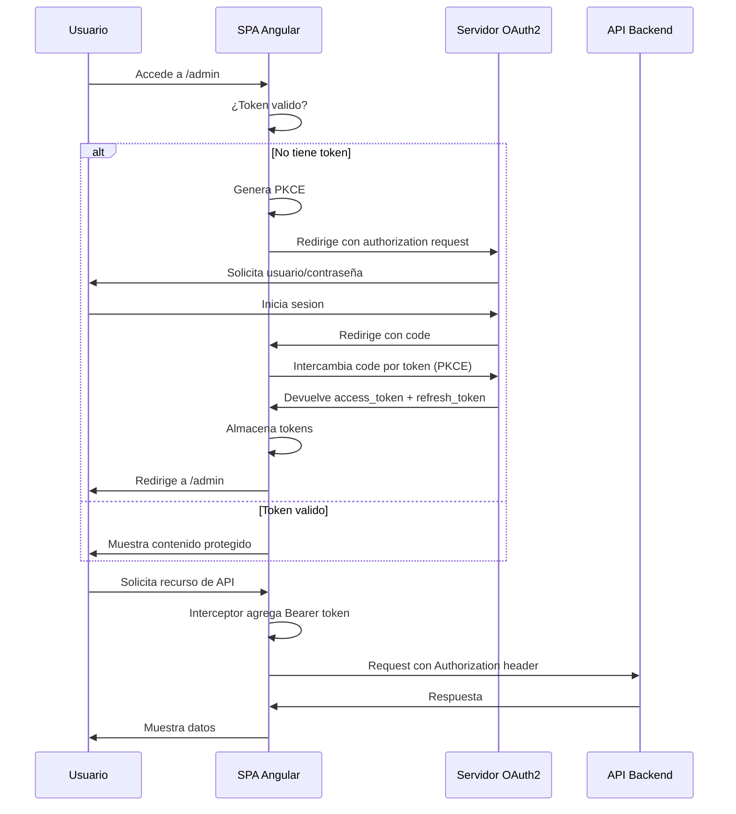

# Arquitectura OAuth2 Empresarial

## Descripcion General

La implementacion de OAuth2 ha sido refactorizada con una arquitectura empresarial escalable y mantenible.

## Estructura de Carpetas

```
src/app/core/auth/
├── services/
│   ├── auth.service.ts              # Servicio principal de autenticacion
│   ├── auth-state.service.ts        # Gestion centralizada del estado
│   ├── token.service.ts             # Gestion de tokens (lectura/escritura)
│   ├── pkce.service.ts              # Generacion y gestion de PKCE
│   └── oauth2-config.service.ts     # Configuracion centralizada de OAuth2
├── guards/
│   └── auth.guard.ts                # Guard para proteger rutas
├── interceptors/
│   └── auth.interceptor.ts          # Interceptor HTTP para tokens
└── auth-callback.component.ts       # Componente para callback de OAuth2
```

## Servicios Principales

### 1. TokenService (token.service.ts)
Gestiona todos los aspectos relacionados con tokens.

Responsabilidades:
- Almacenar tokens en localStorage
- Recuperar tokens
- Validar expiracion
- Limpiar tokens

Metodos publicos:
```typescript
setTokens(accessToken, refreshToken?, expiresIn?, tokenType?)
getAccessToken(): string | null
getRefreshToken(): string | null
isTokenExpired(): boolean
hasAccessToken(): boolean
clearTokens(): void
```

### 2. PKCEService (pkce.service.ts)
Genera y gestiona parametros PKCE para seguridad.

Responsabilidades:
- Generar verifier aleatorio (128 caracteres)
- Generar challenge usando SHA-256
- Almacenar verifier temporalmente
- Limpiar verifier despues del uso

Metodos publicos:
```typescript
generateChallengeAsync(): Promise<PKCEChallenge>
getStoredVerifier(): string | null
clearVerifier(): void
```

### 3. AuthStateService (auth-state.service.ts)
Gestiona el estado centralizado de autenticacion con Signals.

Estados:
- unauthenticated - Usuario no autenticado
- authenticating - En proceso de autenticacion
- authenticated - Usuario autenticado
- error - Error en la autenticacion

Metodos publicos:
```typescript
setAuthenticating(): void
setAuthenticated(): void
setUnauthenticated(): void
setError(error: string): void
isAuthenticated(): boolean
getState(): AuthState
```

### 4. AuthService (auth.service.ts)
Orquestador principal de toda la logica de autenticacion.

Responsabilidades:
- Intercambiar codigo por token
- Refrescar tokens
- Verificar autenticacion
- Logout

Metodos publicos:
```typescript
exchangeCodeForToken(code: string): Promise<TokenResponse>
refreshToken(): Promise<TokenResponse>
isAuthenticated(): boolean
getAccessToken(): string | null
isTokenExpired(): boolean
logout(): void
```

### 5. OAuth2ConfigService (oauth2-config.service.ts)
Centraliza toda la configuracion de OAuth2.

Responsabilidades:
- Almacenar configuracion de OAuth2
- Construir URLs de autorizacion
- Gestionar parametros

Metodos publicos:
```typescript
getConfig(): OAuth2Config
buildAuthorizationUrl(codeChallenge: string): string
```

## Flujo de Autenticacion



## Interceptor HTTP

El interceptor:
1. Agrega token Bearer a requests
2. Omite endpoints de OAuth

## Seguridad

### PKCE (Proof Key for Code Exchange)
- Verifier: String aleatorio de 128 caracteres
- Challenge: SHA-256 del verifier codificado en base64url
- Almacenamiento temporal: sessionStorage
- Limpieza automatica: Despues del token exchange

### Token Storage
- Access Token: localStorage
- Refresh Token: localStorage (si se devuelve)

## Configuracion de Entornos

Los archivos environment.ts y environment.prod.ts contienen:
- oauth2AuthorizeUrl - Endpoint de autorizacion
- clientId - ID del cliente OAuth2
- redirectUri - URI de callback
- scope - Scopes solicitados
- responseMode - form_post o query

## Uso en Componentes

Ejemplo: Verificar Autenticacion
```typescript
constructor(private authService: AuthService) {}

ngOnInit() {
  if (this.authService.isAuthenticated()) {
    // Usuario autenticado
  }
}
```
